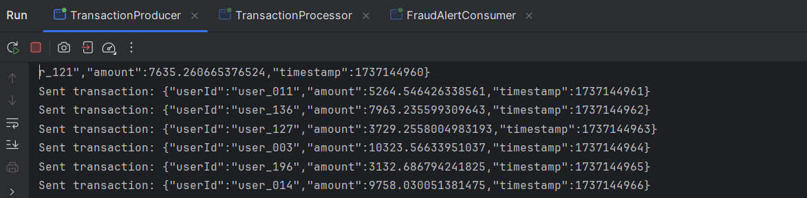
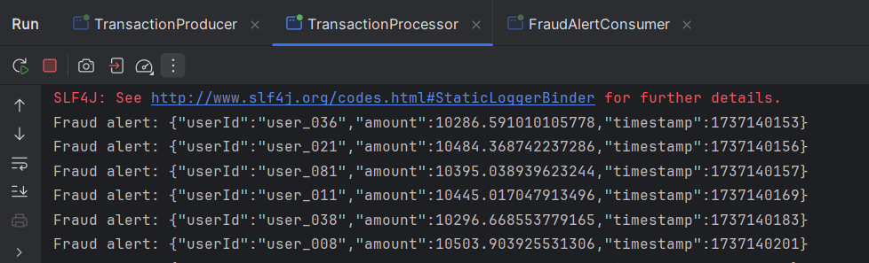
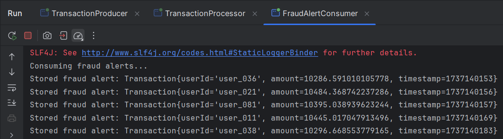
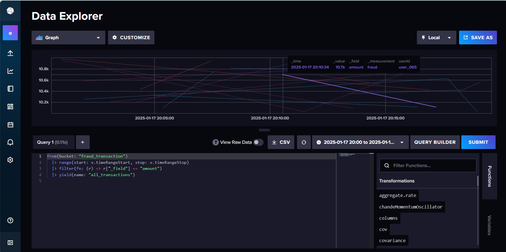
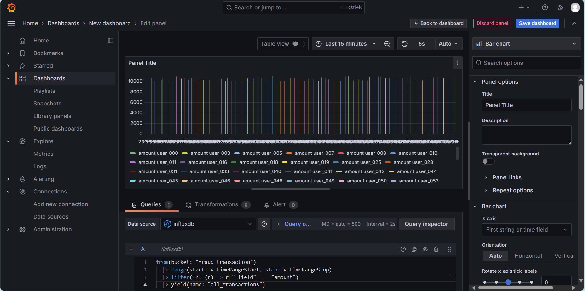

# Kafka Streams Fraud Detection Application

## Description
Ce projet implémente une application Kafka Streams permettant de détecter les transactions financières suspectes en temps réel. Les transactions suspectes sont celles dont le montant dépasse un seuil de 10 000. Les résultats sont publiés dans un topic Kafka et enregistrés dans une base de données InfluxDB pour être visualisés en temps réel via un tableau de bord Grafana.

## Table des matières
- [Architecture Globale](#architecture-globale)
- [Règles de Détection de Fraudes](#règles-de-détection-de-fraudes)
- [Prérequis](#prérequis)
- [Installation](#installation)
- [Configuration de Grafana et InfluxDB](#configuration-de-grafana-et-influxdb)
- [Exécution du Projet](#exécution-du-projet)
- [Validation et Résultats](#validation-et-résultats)
- [Captures d’Écran](#captures-d’écran)

## Architecture Globale


L'application se compose des éléments suivants :
- **Kafka Streams** : Pour traiter les transactions en temps réel.
- **Base de données InfluxDB** : Pour stocker les transactions suspectes.
- **Grafana** : Pour visualiser les données.
- **Docker Compose** : Pour orchestrer les services.

## Règles de Détection de Fraudes
Les transactions suspectes sont détectées selon la règle suivante :
- Montant > 10 000

## Prérequis
- Docker et Docker Compose
- Java 17 ou supérieur
- Maven
- Kafka (via Docker Compose)

## Installation
1. Clonez le dépôt :
   ```bash
   git clone https://github.com/votre-repo/kafka-streams-fraud-detection.git
   cd kafka-streams-fraud-detection
   ```

2. Construisez l'application Java :
   ```bash
   mvn clean package
   ```

3. Lancez les services avec Docker Compose :
   ```bash
   docker-compose up -d
   ```

## Configuration de Grafana et InfluxDB
### Connexion de Grafana à InfluxDB
1. Accédez à l’interface Grafana via `http://localhost:3000`.

2. Ajoutez une nouvelle source de données :
   - Type : InfluxDB
   - URL : `http://influxdb:8086`
   - Base de données : `fraud_transaction`

3. Enregistrez la configuration.

### Création des Tableaux de Bord
1. Créez un nouveau tableau de bord Grafana.
2. Choisir InfluxDB comme source de données.
3. Ajouter la requete suivante: 
```
from(bucket: "fraud_transaction")
  |> range(start: v.timeRangeStart, stop: v.timeRangeStop)
  |> filter(fn: (r) => r["_field"] == "amount")
  |> yield(name: "all_transactions")
```

## Exécution du Projet
1. Démarrez Kafka et les services associés :
   ```bash
   docker-compose up -d
   ```
2. Créer les topics :
```
 kafka-topics --create --topic transactions-input --bootstrap-server localhost:9092 --partitions 1 --replication-factor 1
 kafka-topics --create --topic fraud-alerts --bootstrap-server localhost:9092 --partitions 1 --replication-factor 1
```

## Validation et Résultats
1. Utilisez le jeu de données d’exemple pour simuler des transactions :
   ```json
   {
     "userId": "12345",
     "amount": 15000,
     "timestamp": "2024-12-04T15:00:00Z"
   }
   ```
2. Vérifiez que les transactions suspectes sont publiées dans le topic `fraud-alerts`.
3. Validez l’affichage des données sur le tableau de bord Grafana.

## Captures d’Écran
### Classes et Résultats des Sorties
#### TransactionProducer
```

```

#### TransactionProcessor
```


```
#### FraudAlertConsumer
```

```

### Dashboards
#### Dashboard InfluxDB


#### Dashboard Grafana


## Schéma Docker Compose
Incluez le fichier `docker-compose.yml` pour démarrer Kafka, InfluxDB et Grafana.

```yaml
version: '3.8'
networks:
  monitoring:
    driver: bridge
services:
  zookeeper:
    image: confluentinc/cp-zookeeper:latest
    networks:
      - monitoring
    environment:
      ZOOKEEPER_CLIENT_PORT: 2181
    ports:
      - "2181:2181"

  kafka:
    image: confluentinc/cp-kafka:latest
    networks:
      - monitoring
    depends_on:
      - zookeeper
    ports:
      - "9092:9092"
    environment:
      KAFKA_BROKER_ID: 1
      KAFKA_ZOOKEEPER_CONNECT: zookeeper:2181
      KAFKA_ADVERTISED_LISTENERS: PLAINTEXT://kafka:29092,PLAINTEXT_HOST://localhost:9092
      KAFKA_LISTENER_SECURITY_PROTOCOL_MAP: PLAINTEXT:PLAINTEXT,PLAINTEXT_HOST:PLAINTEXT
      KAFKA_INTER_BROKER_LISTENER_NAME: PLAINTEXT
      KAFKA_OFFSETS_TOPIC_REPLICATION_FACTOR: 1

  influxdb:
    image: influxdb:latest
    networks:
      - monitoring
    ports:
      - "8086:8086"
    environment:
      DOCKER_INFLUXDB_INIT_MODE: setup
      DOCKER_INFLUXDB_INIT_USERNAME: admin
      DOCKER_INFLUXDB_INIT_PASSWORD: adminpassword
      DOCKER_INFLUXDB_INIT_ORG: enset
      DOCKER_INFLUXDB_INIT_BUCKET: fraud_transaction
      DOCKER_INFLUXDB_INIT_ADMIN_TOKEN: my-super-secret-token

  grafana:
    image: grafana/grafana:latest
    networks:
      - monitoring
    ports:
      - "3000:3000"
    environment:
      GF_SECURITY_ADMIN_USER: admin
      GF_SECURITY_ADMIN_PASSWORD: admin
    depends_on:
      - influxdb
    volumes:
      - grafana-data:/var/lib/grafana

volumes:
  grafana-data:
```

## Conclusion
Cette application démontre une intégration complète des technologies Kafka Streams, InfluxDB et Grafana pour détecter et visualiser les transactions financières suspectes en temps réel.
